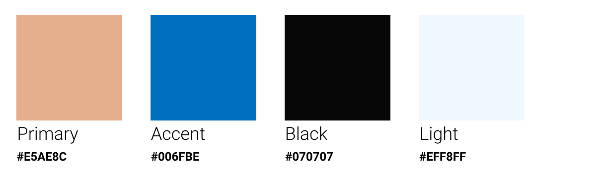
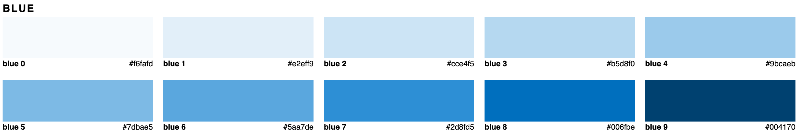
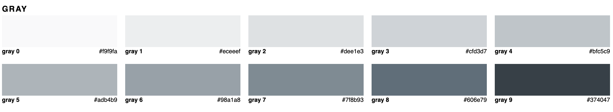

# AlpacaFarm
The Happy Alpaca-A client, an owner of an alpaca farm, commissioned you the project of designing and developing a website to promote their farm online.

Using the assets provided (wireframe, color palette, images), design a landing page to present to the client.

First group project. My team players Kevin and Melanie. We used Bootstrap to make the project.

### Main colors

### Primary color tints

### Accent color tints

### Gray tints

